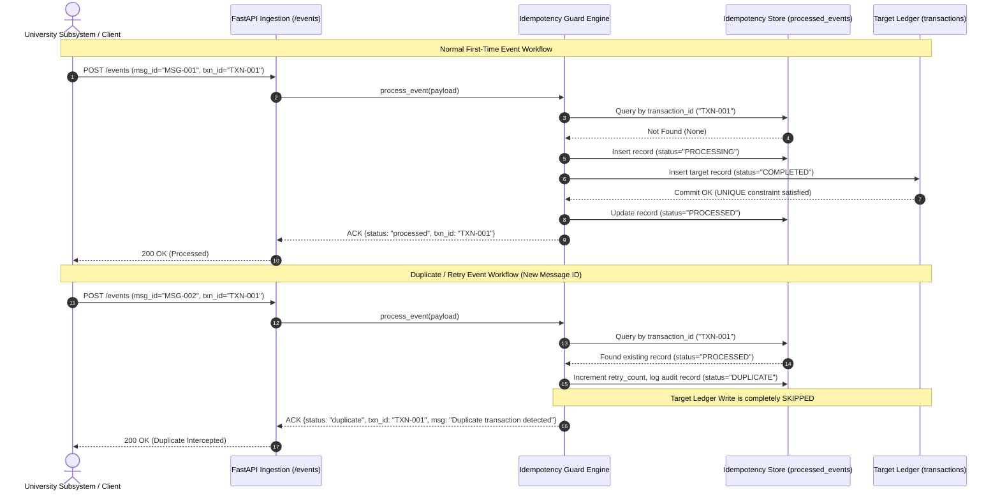
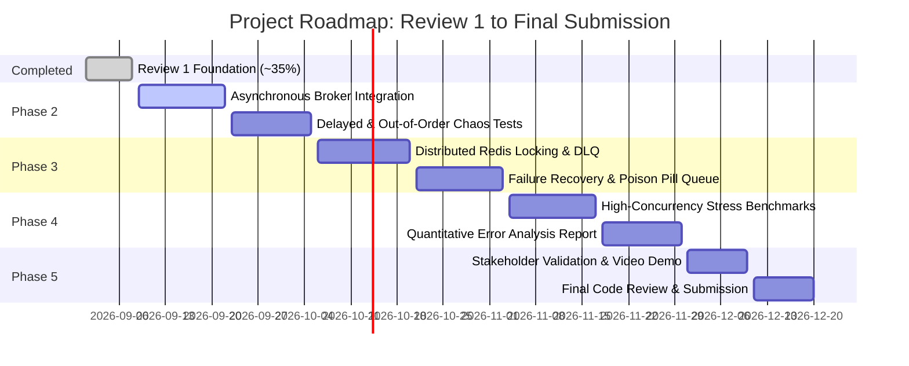

# Review 1 – Project Progress Report

**Evaluation Track:** CoE Growth → Projects  
**Project Title:** From Operational Pain to Working Product: University Automating Processes Across Admissions, Academics, Finance and Alumni Systems  
**Project Type:** Software Project  
**Target Milestone:** Review 1 (Foundational Working Prototype — ~35% Project Completion)  
**Date:** September 8, 2026  

---

## 1. Project Title

**"From Operational Pain to Working Product: University Automating Processes Across Admissions, Academics, Finance and Alumni Systems"**

---

## 2. Problem Statement

Modern university campuses rely on multiple asynchronous enterprise subsystems to manage student lifecycles:
* **Admissions Office:** Handles student onboarding and emits `ADMISSION_CREATED` events.
* **Academic Affairs:** Manages enrollment and grading, emitting `COURSE_ENROLLED` and `MARK_UPDATED` events.
* **Finance Department:** Manages fee remittances, emitting `FEE_PAYMENT` events.
* **Alumni Office:** Tracks graduate directories and contributions, emitting `ALUMNI_UPDATED` events.

### The Operational Challenge: Duplicate Business Events
In distributed messaging environments (webhooks, message queues, microservices), message delivery operates under **at-least-once delivery semantics**. Due to inherent network unreliability, consumer crashes, transient gateway timeouts, and lost transport acknowledgements (ACKs), message producers routinely retry delivery.

Without an **Idempotent Event-Processing Guard**, retried events create duplicate business outcomes and ledger corruption:
* **Lost Acknowledgement & Double Billing Example:** A student initiates a fee remittance of ₹25,000. The university ingestion service processes the payment and writes a target record. However, the transport acknowledgement returned to the payment gateway is dropped due to a network blip. The payment gateway times out and triggers an automated retry. Because the retry arrives in a fresh network envelope, it carries a **new `message_id`**, but represents the **exact same business transaction (`transaction_id`)**.
* **Without Idempotency Protection:** A naive processor treats the new message ID as a new event, creating a second record in the business ledger. The student's account registers a duplicate fee transaction, resulting in accounting discrepancies, audit failures, or double deductions.
* **With the Idempotency Guard:** The guard inspects the domain-level `transaction_id`, recognizes that the business outcome was already executed, suppresses the redundant ledger write, logs the retry in an audit store, and safely returns a cached `status: "duplicate"` acknowledgement.

All data used in this project is strictly **synthetic** (e.g., `MSG-100001`, `TXN-200001`), completely free of real student personal details or Personally Identifiable Information (PII).

---

## 3. Objective

The overarching project objective is to design, implement, and empirically validate an **Idempotent Event-Processing Guard** capable of intercepting and neutralizing duplicate business events across Admissions, Academics, Finance, and Alumni systems.

For the **Review 1 milestone (~35% completion)**, the objective is to build an honest, working foundational prototype that:
1. Distinguishes transport message identifiers (`message_id`) from domain business identifiers (`transaction_id`).
2. Implements a stateful deduplication state machine (`RECEIVED`, `PROCESSING`, `PROCESSED`, `DUPLICATE`, `FAILED`).
3. Enforces dual-layer protection combining application-level state checking with database-level ACID constraints.
4. Provides a working REST API and interactive demonstration simulator.
5. Employs a naive baseline processor and a deterministic 1,000-event synthetic dataset to empirically prove duplicate prevention.

---

## 4. Work Completed So Far

The following modules, interfaces, and validation suites have been constructed and verified directly in the codebase:

### A. Event Dispatcher & Interactive Simulator
* **What was implemented:** An interactive demonstration interface served directly from the FastAPI application ([app.py](file:///d:/COE%20project/app.py)) at `/` and `/dashboard`.
* **How it works:** Provides input controls for `message_id`, `transaction_id`, `event_type`, and conditional `amount` (for fee payments). It features action triggers:
  - *Send Event:* Dispatches the current payload to `POST /events`.
  - *Simulate Exact Duplicate:* Dispatches an identical payload with matching `message_id` and `transaction_id`.
  - *Simulate Retry (New Msg ID):* Simulates producer ACK timeout by generating a new `message_id` while retaining the identical canonical `transaction_id`.
  - *Generate New IDs:* Queries the dynamic backend endpoint `/next-id` to populate non-colliding sequential IDs.
* **Evidence:** [app.py](file:///d:/COE%20project/app.py) lines 178–528.
* **Status:** Fully functional.

### B. Supported University Event Types
* **What was implemented:** Domain-specific university event types across four core subsystems.
* **Supported Types in Code:**
  1. `FEE_PAYMENT` (Subsystem: `FINANCE` — includes numerical monetary amount, e.g., ₹1,500 – ₹50,000)
  2. `ADMISSION_CREATED` (Subsystem: `ADMISSIONS`)
  3. `COURSE_ENROLLED` (Subsystem: `ACADEMICS`)
  4. `MARK_UPDATED` (Subsystem: `ACADEMICS`)
  5. `ALUMNI_UPDATED` (Subsystem: `ALUMNI`)
* **Evidence:** [models.py](file:///d:/COE%20project/models.py) (lines 19–46), [generate_dataset.py](file:///d:/COE%20project/generate_dataset.py) (lines 12–18), [app.py](file:///d:/COE%20project/app.py) (lines 338–346).
* **Status:** Fully operational across API validation schemas and database records.

### C. Idempotency Guard Core Logic & Identifier Separation
* **What was implemented:** Dual-identifier evaluation in [idempotency_guard.py](file:///d:/COE%20project/idempotency_guard.py).
* **Architectural Concept:**
  - **`message_id` (Transport Key):** Ephemeral identifier assigned to a specific transport envelope or network packet. A single business action retried 3 times will have 3 distinct `message_id` values.
  - **`transaction_id` (Domain Key):** Canonical, stable identifier representing the actual business transaction. Remains invariant across network retries.
* **Why `transaction_id` is Essential:** If a deduplication system checks only `message_id`, any producer retry triggered by a network timeout (which wraps the transaction in a new message envelope) will bypass the filter and produce a duplicate ledger entry. By indexing and filtering on `transaction_id`, retries with new message IDs are intercepted.
* **Evidence:** [idempotency_guard.py](file:///d:/COE%20project/idempotency_guard.py) lines 66–122.
* **Status:** Fully functional.

### D. Duplicate Detection & Dual-Layer Protection
* **What was implemented:** Detection of both exact duplicate messages and retries with fresh message envelopes, backed by dual-layer safeguards:
  - **Layer 1 (Application State Store):** Checks the `processed_events` table for prior entries matching `transaction_id` or `message_id`. If matched, updates `retry_count`, logs a `DUPLICATE` audit entry, and aborts target writes.
  - **Layer 2 (ACID Database Constraint):** If two concurrent requests slip through Layer 1 simultaneously, the database table `transactions` enforces a relational `UNIQUE` constraint on `transaction_id`. The second attempt triggers an `IntegrityError`, executes a transaction rollback, and returns a duplicate acknowledgement.
* **Evidence:** [idempotency_guard.py](file:///d:/COE%20project/idempotency_guard.py) lines 66–198; [models.py](file:///d:/COE%20project/models.py) lines 105–113.
* **Status:** Fully implemented and validated.

### E. Target Transaction Records & Schema
* **What was implemented:** Relational SQLite tables managed via SQLAlchemy ORM in [models.py](file:///d:/COE%20project/models.py) and initialized in [database.py](file:///d:/COE%20project/database.py).
* **Table Structures:**
  1. `processed_events` (Tracking & Audit Layer): `id` (PK), `message_id` (Indexed), `transaction_id` (Indexed), `event_type`, `source_system`, `status` (`RECEIVED`, `PROCESSING`, `PROCESSED`, `DUPLICATE`, `FAILED`), `first_seen_at`, `processed_at`, `retry_count`.
  2. `transactions` (Target Business Ledger): `transaction_id` (PK, Unique), `event_type`, `source_system`, `amount` (Nullable float), `processed_at`, `status` (`COMPLETED`).
  3. `baseline_transactions` (Naive Comparison Ledger): `id` (PK), `message_id`, `transaction_id` (**No unique constraint**), `event_type`, `source_system`, `amount`, `processed_at`, `status`.
* **Evidence:** [models.py](file:///d:/COE%20project/models.py) lines 74–131; [database.py](file:///d:/COE%20project/database.py) lines 15–27 (enabling SQLite WAL mode and foreign keys).
* **Status:** Fully functional.

### F. Acknowledgement Generation & Audit Logging
* **What was implemented:** Formal response contract defined by `EventResponse` Pydantic model.
* **Behavior:** Every ingestion request (`POST /events`) receives an immediate, structured JSON acknowledgement:
  - `status`: `"processed"` (first arrival), `"duplicate"` (subsequent retries), or `"failed"`.
  - `transaction_id` and `message_id`.
  - `message`: Contextual message (e.g., indicating the original `message_id` and original completion timestamp).
  - `timestamp`: UTC ISO timestamp.
* **Evidence:** [app.py](file:///d:/COE%20project/app.py) lines 48–57; [models.py](file:///d:/COE%20project/models.py) lines 48–57.
* **Status:** Fully functional.

### G. Baseline Processor (Comparative Reference)
* **What was implemented:** A naive event consumer in [baseline_processor.py](file:///d:/COE%20project/baseline_processor.py) that lacks deduplication and uniqueness constraints.
* **Purpose:** Direct comparison against the Idempotency Guard. Demonstrates how unmitigated message replays and retries create duplicate rows in university business tables.
* **Evidence:** [baseline_processor.py](file:///d:/COE%20project/baseline_processor.py) lines 16–78.
* **Status:** Fully functional.

### H. Synthetic Dataset Generation
* **What was implemented:** Dataset generator script in [generate_dataset.py](file:///d:/COE%20project/generate_dataset.py) producing `data/events.csv`.
* **Actual Dataset Characteristics:**
  - **Total Events:** Exactly 1,000 rows.
  - **Unique Business Transactions:** 800 (80.0%).
  - **Duplicate / Retry Invocations:** 200 (20.0%).
  - **Duplicate Scenarios Modeled:**
    1. `EXACT_DUPLICATE`: Same `message_id` and `transaction_id` re-sent within 5–45 seconds.
    2. `RETRY_NEW_MSG_ID`: Fresh `message_id` generated for existing `transaction_id` within 60–300 seconds (simulating source timeout).
    3. `DELAYED_RETRY`: Re-delivery arriving with 12–48 hour delay.
  - **Event Proportions:** `FEE_PAYMENT` (50%), `ADMISSION_CREATED` (20%), `COURSE_ENROLLED` (15%), `MARK_UPDATED` (10%), `ALUMNI_UPDATED` (5%).
  - **Fields:** `message_id`, `transaction_id`, `event_type`, `source_system`, `event_timestamp`, `amount`, `event_version`, `processing_status`.
* **Evidence:** [generate_dataset.py](file:///d:/COE%20project/generate_dataset.py); [data/events.csv](file:///d:/COE%20project/data/events.csv).
* **Status:** Fully generated and verified.

### I. Empirical Comparative Experiment
* **What was implemented:** Automated benchmark harness in [run_experiment.py](file:///d:/COE%20project/run_experiment.py) executing the 1,000-event dataset through both processors into isolated SQLite databases (`baseline_experiment.db` and `guard_experiment.db`).
* **Actual Results Recorded in `results/baseline_vs_guard.csv`:**
  - Events Received: Baseline = 1,000 | Guard = 1,000
  - Unique Transactions: Baseline = 800 | Guard = 800
  - Duplicate Attempts: Baseline = 200 | Guard = 200
  - Target Records Created: Baseline = **1,000** | Guard = **800**
  - Duplicate Business Outcomes: Baseline = **200** | Guard = **0**
  - Duplicates Prevented: Baseline = 0 | Guard = **200**
  - Duplicate Prevention Rate: Baseline = **0.0%** | Guard = **100.0%**
  - Processing Failures: Baseline = 0 | Guard = 0
* **Evidence:** [run_experiment.py](file:///d:/COE%20project/run_experiment.py); [results/baseline_vs_guard.csv](file:///d:/COE%20project/results/baseline_vs_guard.csv).
* **Status:** Executed and empirically recorded.

### J. Automated Test Suite
* **What was implemented:** Automated pytest test suite in [tests/test_idempotency.py](file:///d:/COE%20project/tests/test_idempotency.py) executed against an isolated in-memory SQLite database (`sqlite:///:memory:`).
* **Suite Summary (6/6 Tests Passing):**
  1. `test_1_normal_event`: Validates single normal event ingestion; verifies `status="processed"` and exactly 1 target record.
  2. `test_2_exact_duplicate`: Sends identical event twice; verifies first is `"processed"`, second is `"duplicate"`, and target count remains 1.
  3. `test_3_retry_with_new_message_id`: Sends `MSG-100001` -> `TXN-300001` followed by `MSG-100002` -> `TXN-300001`; verifies the guard catches the duplicate business transaction despite the fresh message ID, increments retry audit count, and maintains 1 target record.
  4. `test_4_different_transactions`: Sends two different transactions; verifies both process successfully and create 2 distinct target records.
  5. `test_5_multiple_subsystems`: Verifies event ingestion across all 4 subsystems (`ADMISSIONS`, `ACADEMICS`, `FINANCE`, `ALUMNI`).
  6. `test_6_next_id_endpoint`: Verifies `/next-id` dynamically queries max committed IDs and calculates sequential increments.
* **Evidence:** [tests/test_idempotency.py](file:///d:/COE%20project/tests/test_idempotency.py); execution verified via pytest (6 passed in 2.33s).
* **Status:** 100% test pass rate.

---

## 5. Currently Working Summary

| Component / Subsystem | Status | Technical Description | Evidence File |
|:---|:---:|:---|:---|
| **Event Simulator & UI** | **Working** | Interactive web dashboard at `/` and `/dashboard` for manual dispatch, duplicate simulation, and real-time logs | [app.py](file:///d:/COE%20project/app.py) (L178–528) |
| **REST Ingestion API** | **Working** | `POST /events` with Pydantic payload validation and structured ACK generation | [app.py](file:///d:/COE%20project/app.py) (L39–57) |
| **Audit & Query APIs** | **Working** | `GET /events/{txn_id}`, `GET /transactions`, `GET /metrics`, `GET /next-id`, `GET /health` | [app.py](file:///d:/COE%20project/app.py) (L64–171) |
| **Idempotency Guard Engine** | **Working** | Stateful event processing with 5 lifecycle states (`RECEIVED`, `PROCESSING`, `PROCESSED`, `DUPLICATE`, `FAILED`) | [idempotency_guard.py](file:///d:/COE%20project/idempotency_guard.py) (L28–214) |
| **Duplicate Detection** | **Working** | Detects exact duplicates and producer retries with new message IDs | [idempotency_guard.py](file:///d:/COE%20project/idempotency_guard.py) (L69–122) |
| **Target Storage & ACID Guard** | **Working** | SQLite tables (`processed_events`, `transactions`) with relational `UNIQUE` constraint on `transaction_id` | [models.py](file:///d:/COE%20project/models.py), [database.py](file:///d:/COE%20project/database.py) |
| **Baseline Processor** | **Working** | Naive processor inserting unvalidated duplicates into `baseline_transactions` | [baseline_processor.py](file:///d:/COE%20project/baseline_processor.py) |
| **Synthetic Dataset** | **Working** | Exactly 1,000 synthetic events (800 unique, 200 duplicates) with zero PII | [data/events.csv](file:///d:/COE%20project/data/events.csv), [generate_dataset.py](file:///d:/COE%20project/generate_dataset.py) |
| **Comparative Experiment** | **Working** | Benchmark runner recording zero duplicate business outcomes in guard vs. 200 in baseline | [run_experiment.py](file:///d:/COE%20project/run_experiment.py), [results/baseline_vs_guard.csv](file:///d:/COE%20project/results/baseline_vs_guard.csv) |
| **Automated Test Suite** | **Working** | 6 automated pytest test cases covering edge cases, retries, and multi-subsystem events | [tests/test_idempotency.py](file:///d:/COE%20project/tests/test_idempotency.py) |
| **Distributed Message Broker** | *Not Implemented* | Currently uses direct HTTP and CSV ingestion; Kafka / RabbitMQ cluster integration planned for later phases | Planned Phase 2/3 |
| **Distributed Cache / Locks** | *Not Implemented* | Currently uses single-node SQLite transactions; Redis distributed locks planned for high-concurrency scale | Planned Phase 3 |
| **Dead-Letter Queue (DLQ)** | *Not Implemented* | Failed events transition to `FAILED` in database; automated DLQ retry daemon planned for Phase 3 | Planned Phase 3 |

---

## 6. Key Features & Modules Completed

1. **Event Dispatcher & Web Dashboard ([app.py](file:///d:/COE%20project/app.py)):** Serves an interactive dark-mode user interface that enables evaluators to manually dispatch events, simulate duplicates, trigger retries, and observe live ledger updates.
2. **Idempotency Guard Engine ([idempotency_guard.py](file:///d:/COE%20project/idempotency_guard.py)):** Implements the state machine and dual-layer deduplication logic that separates transport envelopes from business transaction keys.
3. **Data Models & Storage Schema ([models.py](file:///d:/COE%20project/models.py), [database.py](file:///d:/COE%20project/database.py)):** Defines Pydantic validation schemas and SQLAlchemy ORM entities with WAL journaling and strict relational unique constraints.
4. **Baseline Processor ([baseline_processor.py](file:///d:/COE%20project/baseline_processor.py)):** Provides an unmitigated reference implementation to quantify the exact business consequences of duplicate event processing.
5. **Synthetic Dataset Generator ([generate_dataset.py](file:///d:/COE%20project/generate_dataset.py)):** Creates a deterministic 1,000-event benchmark stream with realistic jitter, fee amounts, and retry distributions.
6. **Empirical Benchmark Runner ([run_experiment.py](file:///d:/COE%20project/run_experiment.py)):** Ingests the 1,000-event benchmark across both architectures and records comparative metrics to CSV.
7. **Automated Verification Suite ([tests/test_idempotency.py](file:///d:/COE%20project/tests/test_idempotency.py)):** Delivers regression testing across core idempotency scenarios with 100% pass rate.

---

## 7. Workflow Map

The following sequence details how normal events and duplicate retries navigate the Idempotency Guard:

---

## 8. Privacy & Data Minimisation (Zero PII Compliance)

In adherence to data privacy principles and academic project standards:
* **Zero Personally Identifiable Information:** The project does NOT collect, store, or process real student names, email addresses, phone numbers, home addresses, government identifiers (e.g., Aadhaar, SSN), bank account numbers, or academic transcripts.
* **Deterministic Synthetic Keys:** All data entities use synthetic identifiers:
  - Transport keys: `MSG-000001` through `MSG-001000`
  - Business keys: `TXN-000001` through `TXN-000800`
* **Purpose-Limited Schema:** Only attributes strictly required to demonstrate event deduplication (`event_type`, `source_system`, `amount`, and `event_timestamp`) are included.

---

## 9. Current Limitations & Pending Work

To maintain academic and technical integrity, the following limitations of the current Review 1 implementation are explicitly acknowledged:

1. **Single-Node Ingestion:** The current implementation runs on SQLite with WAL mode. While suitable for the Review 1 prototype and in-process concurrency testing, it does not yet support multi-node distributed clustering.
2. **Synchronous HTTP Ingestion:** Ingestion currently occurs via REST endpoints and sequential CSV replay rather than an asynchronous distributed message broker cluster (e.g., Apache Kafka or RabbitMQ).
3. **In-Memory Concurrency Protection:** Race condition safety currently relies on SQLite's transactional locks and database-level `UNIQUE` constraints; distributed locks (e.g., Redis Redlock) have not yet been introduced.
4. **Dead-Letter Queue (DLQ) Automation:** While failed transactions transition to `FAILED` in the database, automated DLQ routing, retry backoff algorithms (exponential backoff with jitter), and poison-pill quarantines are not yet implemented.
5. **Real-Time Fault Injection:** Network latency simulation is currently demonstrated via synthetic timestamps and batch reordering in CSV rather than dynamic network fault injection at runtime.

---

## 10. Next Steps & Post-Review 1 Roadmap

The remaining ~65% of project implementation will be executed across the following phases:

* **Phase 2: Broker & Chaos Ingestion (Target: 50% Milestone)**
  - Integrate message queue consumers (RabbitMQ / Kafka-compatible connector).
  - Implement dynamic network latency simulation and delayed event buffers.
  - Expand out-of-order event stream testing under varying consumer delays.
* **Phase 3: Concurrency Hardening & Failure Recovery (Target: 70% Milestone)**
  - Implement distributed locks (Redis / PostgreSQL row-level locks) for high-concurrency event bursts.
  - Build automated Dead-Letter Queue (DLQ) routing for events entering `FAILED` status.
  - Implement exponential backoff with decorrelated jitter for source retries.
* **Phase 4: Large-Scale Benchmark & Error Analysis (Target: 85% Milestone)**
  - Scale empirical benchmarks from 1,000 to 50,000+ events.
  - Profile system latency overhead introduced by the guard (p50, p95, p99 latency).
  - Produce comprehensive comparative error and resource consumption reports.
* **Phase 5: Stakeholder Evaluation & Packaging (Target: 100% Milestone)**
  - Conduct simulated stakeholder evaluations across university department personas.
  - Record a 3–5 minute professional video demonstration.
  - Finalize GitHub repository, Docker Compose configurations, and deployment runbooks.

---

## 11. Review 1 Achievement Summary

The Review 1 milestone focused on establishing a **fully functional, verified technical foundation** rather than presenting a theoretical concept. 

The progress achieved to date represents approximately **35% of the overall project lifecycle**:
* A complete, working dual-layer Idempotency Guard has been written, debugged, and integrated.
* A naive baseline processor has been built to empirically establish the failure rate of unprotected university systems.
* A 1,000-event synthetic dataset with zero PII and realistic retry distributions has been created and replayed.
* An empirical experiment proved that the guard achieved a **100.0% duplicate prevention rate** (0 duplicate outcomes out of 200 retries), compared to a **0.0% prevention rate** in the baseline.
* 6 automated pytest tests pass with zero errors, and an interactive demonstration UI is fully live.

This foundational milestone proves the viability of the core algorithmic approach and provides a rock-solid platform for asynchronous scaling in Phase 2.

---

## 12. Evidence-Based Implementation Index

| File Reference | Component / Function | Purpose / Contribution |
|:---|:---|:---|
| [app.py](file:///d:/COE%20project/app.py) (L39–57) | `ingest_event()` | REST API endpoint (`POST /events`) receiving event payloads |
| [app.py](file:///d:/COE%20project/app.py) (L140–171) | `get_next_available_id()` | Dynamic generator (`GET /next-id`) calculating sequential transaction and message IDs |
| [app.py](file:///d:/COE%20project/app.py) (L178–528) | `serve_dashboard()` | Interactive HTML/JS dashboard with simulator buttons and live table |
| [idempotency_guard.py](file:///d:/COE%20project/idempotency_guard.py) (L45–214) | `IdempotencyGuard.process_event()` | Core state machine managing `RECEIVED` → `PROCESSING` → `PROCESSED` / `DUPLICATE` / `FAILED` |
| [idempotency_guard.py](file:///d:/COE%20project/idempotency_guard.py) (L215–240) | `IdempotencyGuard.process_csv()` | Ingests CSV dataset and calculates duplicate prevention rates |
| [baseline_processor.py](file:///d:/COE%20project/baseline_processor.py) (L34–78) | `BaselineProcessor.process_event()` | Naive processor demonstrating duplicate ledger creation |
| [models.py](file:///d:/COE%20project/models.py) (L19–46) | `EventPayload` | Pydantic schema enforcing validation on incoming events without PII |
| [models.py](file:///d:/COE%20project/models.py) (L74–113) | `ProcessedEventRecord`, `TransactionRecord` | SQLAlchemy ORM tables establishing dual-layer state and relational uniqueness |
| [database.py](file:///d:/COE%20project/database.py) (L20–27) | `set_sqlite_pragma()` | Configures SQLite WAL mode and enables foreign key enforcement |
| [generate_dataset.py](file:///d:/COE%20project/generate_dataset.py) (L24–125) | `generate_dataset()` | Generates 1,000 synthetic events with 80% unique transactions and 20% retries |
| [run_experiment.py](file:///d:/COE%20project/run_experiment.py) (L17–86) | `run_experiment()` | Executes comparative trial across isolated databases and outputs CSV results |
| [tests/test_idempotency.py](file:///d:/COE%20project/tests/test_idempotency.py) | Full Test Suite (6 Tests) | Pytest suite validating single events, exact duplicates, retries with new IDs, and multi-subsystem events |
| [results/baseline_vs_guard.csv](file:///d:/COE%20project/results/baseline_vs_guard.csv) | Benchmark Output File | Verified numerical output comparing baseline (0% prevention) vs guard (100% prevention) |

---

## 13. Final Review 1 Checklist

- [x] **Problem Analyzed:** Detailed operational breakdown of Admissions, Academics, Finance, and Alumni duplicate event risks.
- [x] **Workflow Identified:** End-to-end event lifecycle and duplicate retry interception mapped.
- [x] **Synthetic Data Created:** 1,000-event dataset generated with zero PII (`data/events.csv`).
- [x] **Architecture Implemented:** Modular multi-file architecture with clear separation of concerns.
- [x] **Baseline Implemented:** Naive processor demonstrating 200 duplicate business outcomes on 200 retries.
- [x] **Idempotency Guard Implemented:** Stateful dual-layer guard distinguishing `message_id` from `transaction_id`.
- [x] **Target Records Implemented:** Relational `transactions` table with `UNIQUE` constraint protection.
- [x] **Duplicate Testing Completed:** 6 automated pytest tests passing with 100% success rate.
- [x] **Interactive Simulator Live:** Web dashboard with direct buttons for normal, duplicate, and retry scenarios.
- [ ] **Asynchronous Message Broker Integration (Kafka / RabbitMQ):** Deferred to Phase 2.
- [ ] **Distributed Redis Locking:** Deferred to Phase 3.
- [ ] **Automated Dead-Letter Queue (DLQ) Handler:** Deferred to Phase 3.
- [ ] **Large-Scale Multi-Node Concurrency Stress Testing:** Deferred to Phase 4.
- [ ] **Final Stakeholder Validation & 3-Minute Video:** Deferred to Phase 5.
